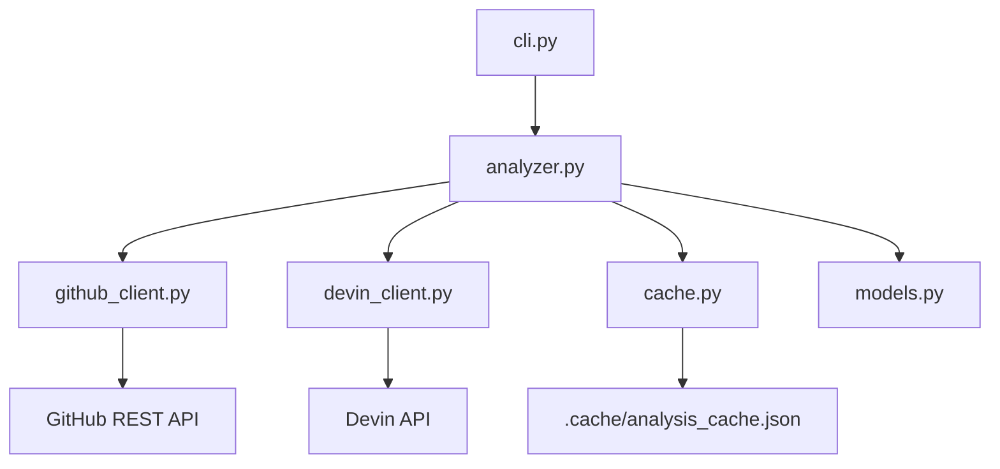
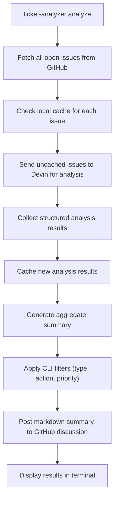
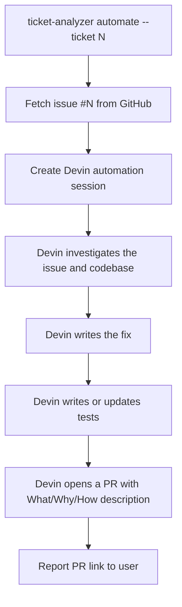

# Ticket Automation Tool

A Python CLI that uses the **Devin API** to analyze open GitHub issues, classify them, and optionally trigger automated fixes. Point it at any GitHub repo and get a structured breakdown of what Devin can fix automatically and what needs human review.

---

## What It Does

1. **Fetches all open issues** — Scans a GitHub repo for all open issues
2. **Analyzes each issue with Devin** — Sends each issue to the Devin API, which investigates the codebase and returns a structured assessment
3. **Caches results locally** — Stores analysis results in a local JSON cache so unchanged issues aren't re-analyzed on subsequent runs
4. **Generates a summary** — Aggregates results by type, priority, and recommended action
5. **Posts to GitHub** — Creates a new timestamped discussion for each analysis run (e.g., "Open Ticket Summary ran April 9th at 4:47 pm")
6. **Displays results in your terminal** — Shows a formatted table of the top tickets ranked by priority and confidence

You can also **automate fixes** — point the tool at a specific issue and Devin will investigate, fix the code, write tests, and open a PR.

---

## How the Analysis Works

For each open issue, the tool creates a Devin session with a prompt that includes the issue title, body, and labels. Devin investigates the issue against the actual codebase and returns a structured JSON response with these fields:

| Field | Values | Description |
|-------|--------|-------------|
| **Type** | `bug`, `feature`, `cleanup` | What kind of issue this is |
| **Action** | `automate`, `engineer_review`, `needs_more_info` | What should be done next |
| **Action Reasoning** | *(free text)* | Why this action was recommended — e.g., "Simple error handling fix in one function" |
| **Confidence** | `0–100%` | How confident Devin is in its analysis |
| **Priority** | `high`, `medium`, `low` | How urgent this issue is |
| **Complexity** | `high`, `medium`, `low` | How difficult the fix would be |
| **Complexity Reasoning** | *(free text)* | Why this complexity was assigned — e.g., "Requires rewriting the expression parser" |
| **Description** | *(free text)* | Generated summary of the issue and recommended approach |

### What the actions mean

- **`automate`** — Devin can fix this autonomously. These are typically simple bugs with clear reproduction steps and localized fixes (e.g., adding error handling, fixing a type conversion).
- **`engineer_review`** — The fix is too complex or risky for automation. A human should review and decide the approach (e.g., rewriting a parser for correct operator precedence).
- **`needs_more_info`** — The issue description is too vague to act on. Someone should ask the reporter for reproduction steps or clarification.

---

## Prerequisites

- **Python 3.11+** — check with `python3 --version`
- **pip** — comes with Python
- **GitHub personal access token** — with `repo` scope ([create one here](https://github.com/settings/tokens/new))
- **Devin API token** — from your [Devin settings](https://app.devin.ai/settings)

---

## Installation

```bash
# 1. Clone the repository
git clone https://github.com/papatel5698/ticket-automation-tool.git
cd ticket-automation-tool

# 2. Install in editable mode (this also installs click and requests)
pip install -e .

# 3. Verify the CLI is available
ticket-analyzer --help
```

After step 2, the `ticket-analyzer` command is available globally in your shell.

---

## Configuration

### Option A: Environment Variables

```bash
export DEVIN_API_TOKEN=your_devin_token
export GITHUB_TOKEN=your_github_token
export GITHUB_REPO=papatel5698/calculator-demo
```

### Option B: CLI Flags

Every command accepts `--token`, `--github-token`, and `--repo` flags. Flags take precedence over environment variables.

```bash
ticket-analyzer analyze --token YOUR_DEVIN_TOKEN --github-token YOUR_GITHUB_TOKEN --repo owner/repo
```

---

## Usage

### Full Analysis

Analyze all open issues in the target repo:

```bash
ticket-analyzer analyze
```

This will:
1. Fetch all open issues from the repo
2. Check the local cache for previously analyzed issues (skipping unchanged ones)
3. Send uncached issues to Devin for analysis
4. Post a markdown summary as a new timestamped discussion on GitHub
5. Print a summary and top-10 table to your terminal

**Example output:**

```
Tickets Summary
───────────────
Total tickets:        20
By type:              8 bugs, 4 features, 4 cleanup
By action:            4 automate, 8 engineer review, 4 needs more info
By priority:          5 high, 9 medium, 6 low

Top 10 Tickets
──────────────
#   | Priority  | Type      | Action            | Confidence  | Complexity  | Title
2   | high      | bug       | automate          | 95%         | low         | Division by zero crashes the program
3   | high      | bug       | automate          | 92%         | low         | Empty input crashes the program
4   | high      | bug       | automate          | 93%         | low         | Division returns integer instead of decimal
6   | high      | bug       | engineer_review   | 88%         | high        | Operator precedence is wrong
5   | medium    | bug       | automate          | 90%         | low         | Whitespace in expressions causes parse error
7   | medium    | bug       | engineer_review   | 85%         | medium      | Negative number input causes parse error
8   | medium    | bug       | engineer_review   | 80%         | medium      | Repeated calculations show previous result
11  | medium    | feature   | engineer_review   | 70%         | high        | Add support for parentheses
9   | low       | bug       | needs_more_info   | 30%         | unknown     | Calculator gives wrong answer for large numbers
10  | low       | bug       | needs_more_info   | 20%         | unknown     | It crashed yesterday
```

### Override Defaults Per-Run

```bash
# Show top 20 instead of top 10
ticket-analyzer analyze --top 20
```

### Single Ticket Deep-Dive

Get a detailed analysis of one specific issue:

```bash
ticket-analyzer analyze --ticket 2
```

**Example output:**

```
Ticket #2: Division by zero crashes the program
────────────────────────────────────────────────
Type:                 bug
Action:               automate
Action Reasoning:     This is a simple error handling fix. The division operation
                      in calculator.py lacks a try/except block. Adding a
                      ZeroDivisionError catch with a user-friendly message is a
                      one-function change.
Confidence:           95%
Priority:             high
Complexity:           low
Complexity Reasoning: The fix requires adding a 3-line try/except block in the
                      divide() function in calculator.py. No other files are affected.
```

### Filtered Analysis

Filter the ticket list by type, action, or priority. Filters can be combined (AND logic). The summary section always shows the full picture — only the ticket list is filtered.

```bash
# Show only tickets Devin can automate
ticket-analyzer analyze --action automate

# Show only bugs
ticket-analyzer analyze --type bug

# Show only high-priority issues
ticket-analyzer analyze --priority high

# Combine filters: high-priority bugs that can be automated
ticket-analyzer analyze --type bug --action automate --priority high
```

### Skip Cache

Force re-analysis of all issues, ignoring cached results:

```bash
ticket-analyzer analyze --no-cache
```

### Clear Cache

Remove all cached analysis results:

```bash
ticket-analyzer clear-cache
```

### Automate a Fix

Tell Devin to fix a specific issue and open a PR:

```bash
ticket-analyzer automate --ticket 2
```

This creates a Devin session that:
1. Investigates the issue and the codebase
2. Writes a fix
3. Adds or updates tests
4. Opens a PR with a description in this format:

```markdown
## What
[Description of what the issue was]

## Why
[Explanation of why it needed to be fixed]

## How
[Description of how it was fixed]

Resolves #2
```

---

## Caching

Analysis results are cached locally in `.cache/analysis_cache.json` to avoid re-analyzing unchanged issues. The cache key is based on a SHA-256 hash of each issue's number, title, and body — so the cache is automatically invalidated when the issue content changes, but not when metadata like labels or timestamps are updated.

- **Cache is used by default** — previously analyzed issues are loaded from cache on subsequent runs
- **Skip cache per-run** — use `ticket-analyzer analyze --no-cache` to re-analyze everything from scratch
- **Clear cache** — use `ticket-analyzer clear-cache` to delete all cached results

The `.cache/` directory is gitignored and safe to delete at any time.

---

## Workflow Diagrams

### Architecture



### Analyze Command Flow



### Automate Command Flow



---

## Running Tests

All tests use mocked API responses — no tokens or network access needed.

```bash
# Install test dependencies
pip install -r requirements-dev.txt

# Run all tests
pytest tests/ -v
```

**Expected result: all tests pass.**

Tests cover:
- **`test_github_client.py`** — Fetching issues, adding labels, posting comments, pagination, PR filtering
- **`test_devin_client.py`** — Session creation, status polling, result parsing, timeouts
- **`test_analyzer.py`** — Summary generation, filtering, sorting, formatting, full analysis flow

---

## Project Structure

```
ticket-automation-tool/
├── src/
│   ├── __init__.py
│   ├── cli.py              # Click-based CLI — entry point for all commands
│   ├── cache.py            # Local JSON cache for analysis results
│   ├── github_client.py    # GitHub REST API — issues, labels, comments
│   ├── devin_client.py     # Devin API — session creation, polling, parsing
│   ├── analyzer.py         # Orchestration — analysis, formatting, caching
│   └── models.py           # Data models (TicketAnalysis, AnalysisSummary)
├── tests/
│   ├── __init__.py
│   ├── test_github_client.py
│   ├── test_devin_client.py
│   └── test_analyzer.py
├── requirements.txt         # click, requests
├── requirements-dev.txt     # pytest
├── setup.py                 # console_scripts entry point: ticket-analyzer
├── .env.example             # Template for environment variables
├── .gitignore
└── README.md
```

---

## Next Steps

These features are planned for future releases:

- **Knowledge Store** (`knowledge.py`, `knowledge_store.json`) — Local learning across runs. The tool would remember past analyses and improve recommendations over time by building a local database of issue patterns, fix outcomes, and confidence calibration.

- **GitHub Actions Weekly Workflow** (`.github/workflows/weekly_analysis.yml`) — Automated weekly runs. A scheduled GitHub Action that runs `ticket-analyzer analyze` every week and posts the summary to the tracking issue automatically — no manual execution needed.
